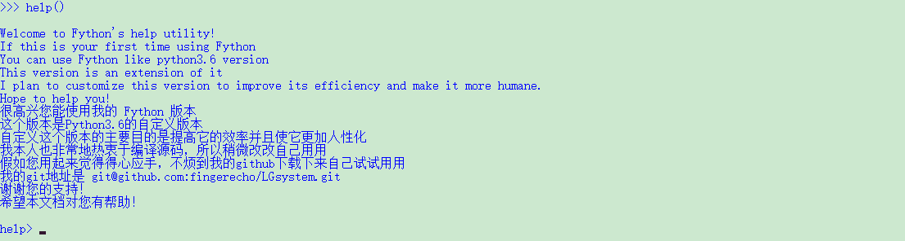

##following https://devguide.python.org/ , I started this repo for Python-Learning .

##This is Python version 3.6.7 that customed
##That we called it Fython 1.0
Build Instructions

    ./configure
    make
    make test
    sudo make install

This will install Fython 1.0.

##how to build
Build Python, on UNIX and Mac OS use:

	./configure --with-pydebug && make -j
	
	and on Windows use:
	PCbuild\build.bat -e -d

##how to test version

	./python -m test -j3

